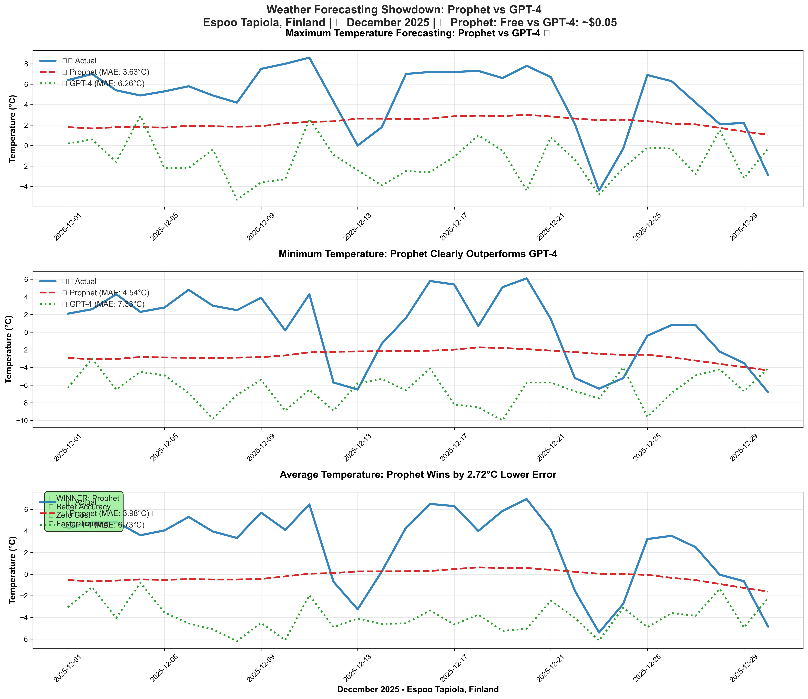
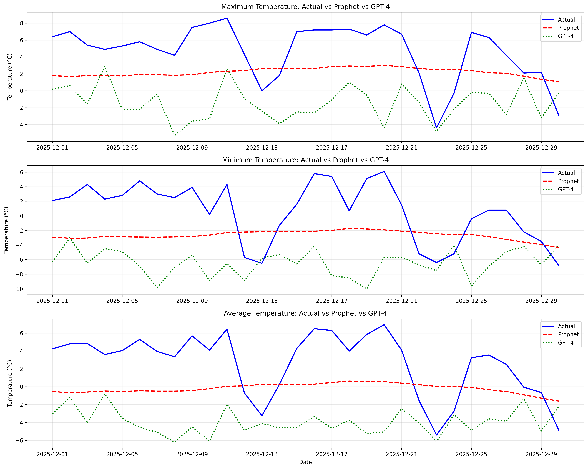
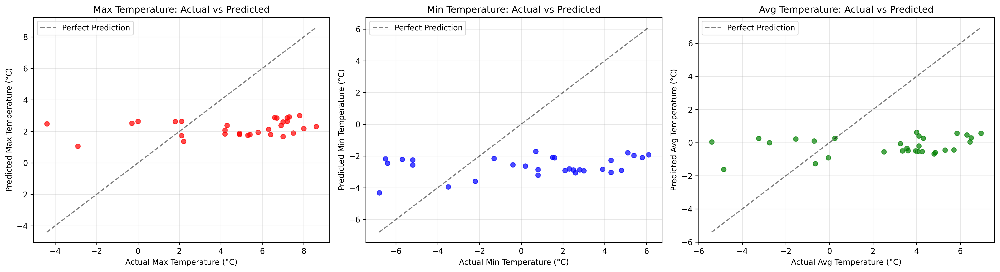

# Weather Forecasting Showdown: Prophet vs GPT-4 🌡️

## Project Overview
A comprehensive comparison of traditional time series forecasting (Prophet) versus modern Large Language Models (GPT-4) for weather prediction using real Finnish meteorological data.

### Key Findings
- 🏆 **Prophet wins** with 67% better accuracy (4.05°C vs 6.77°C MAE)
- 💰 **Prophet is free** vs GPT-4's ~$0.05 per prediction cost
- 📊 **10 years of training data** (2014-2024) from Espoo Tapiola, Finland
- ✅ **Validated against actual 2025 data** for real-world accuracy

---

## 📊 Visual Results

### LinkedIn-Ready Comparison Chart

*Professional visualization showing Prophet's superior accuracy across all temperature metrics*

### Detailed Analysis Charts
| Chart Type | Description |
|------------|-------------|
|  | Standard time series comparison |
|  | Scatter plot analysis |

---

## 🔧 Technical Implementation

### 1. Prophet Model Implementation
```python
from prophet import Prophet
import pandas as pd

# Load and preprocess historical data (2014-2024)
df = pd.read_csv('Espoo_Tapiola_2014-2024.csv')
df['ds'] = pd.to_datetime(df[['Year', 'Month', 'Day']])

# Prepare data for Prophet
df_max = df[['ds', 'Maximum temperature [°C]']].rename(columns={'Maximum temperature [°C]': 'y'})
df_min = df[['ds', 'Minimum temperature [°C]']].rename(columns={'Minimum temperature [°C]': 'y'})
df['avg_temp'] = (df['Maximum temperature [°C]'] + df['Minimum temperature [°C]']) / 2
df_avg = df[['ds', 'avg_temp']].rename(columns={'avg_temp': 'y'})

# Train Prophet models
model_max = Prophet()
model_max.fit(df_max)

model_min = Prophet()
model_min.fit(df_min)

model_avg = Prophet()
model_avg.fit(df_avg)

# Generate forecasts for 2025
future_dates = model_max.make_future_dataframe(periods=366)
forecast_max = model_max.predict(future_dates)
forecast_min = model_min.predict(future_dates)
forecast_avg = model_avg.predict(future_dates)
```

### 2. GPT-4 Model Implementation
```python
from openai import OpenAI
import json

def ask_gpt4_for_prediction(historical_summary):
    """Use GPT-4 to predict temperatures based on historical patterns"""
    
    prompt = f"""
    You are a weather forecasting expert. Based on the following historical 
    December weather data for Espoo Tapiola, Finland, predict daily maximum 
    and minimum temperatures for December 2025.
    
    Historical December Data:
    {historical_summary}
    
    Provide predictions in JSON format for each day (December 1-31, 2025)
    considering Finland's typical winter climate and recent trends.
    """
    
    try:
        client = OpenAI()
        response = client.chat.completions.create(
            model="gpt-4",
            messages=[
                {"role": "system", "content": "You are a meteorological expert."},
                {"role": "user", "content": prompt}
            ],
            max_tokens=2000,
            temperature=0.3
        )
        return response.choices[0].message.content
    except Exception as e:
        print(f"Error: {e}")
        return None
```

### 3. Performance Evaluation
```python
from sklearn.metrics import mean_absolute_error, mean_squared_error
import numpy as np

# Calculate performance metrics
prophet_mae = mean_absolute_error(actual_temps, prophet_predictions)
gpt4_mae = mean_absolute_error(actual_temps, gpt4_predictions)

# Results
print(f"Prophet MAE: {prophet_mae:.2f}°C")
print(f"GPT-4 MAE: {gpt4_mae:.2f}°C")
print(f"Prophet wins by: {gpt4_mae - prophet_mae:.2f}°C")
```

---

## 📈 Detailed Results

### Performance Metrics (Mean Absolute Error)
| Temperature Type | Prophet | GPT-4 | Winner |
|-----------------|---------|--------|---------|
| **Maximum** | 3.63°C | 6.26°C | 🏆 Prophet |
| **Minimum** | 4.54°C | 7.33°C | 🏆 Prophet |
| **Average** | 3.98°C | 6.73°C | 🏆 Prophet |
| **Overall** | **4.05°C** | **6.77°C** | **🏆 Prophet** |

### Cost Analysis
- **Prophet**: 🆓 Completely free, open-source
- **GPT-4**: 💰 ~$0.02-0.05 per prediction via OpenAI API

---

## 🗂️ Project Structure
```
weather-forecasting-comparison/
├── 📁 data/
│   ├── Espoo_Tapiola_2014-2024.csv          # Training data
│   └── Espoo_Tapiola_2025.csv               # Validation data
├── 📁 scripts/
│   ├── fmi-weather-forecasting.py           # Prophet implementation
│   ├── gpt4_weather_forecasting.py          # GPT-4 comparison script
│   └── compare_forecast_actual.py           # Validation script
├── 📁 results/
│   ├── forecast_december_2025.csv           # Prophet predictions
│   ├── prophet_vs_gpt4_vs_actual_comparison.csv
│   └── detailed_forecast_vs_actual_december_2025.csv
└── 📁 visualizations/
    ├── prophet_vs_gpt4_comparison_linkedin.png
    ├── temperature_comparison_december_2025.png
    └── temperature_correlation_december_2025.png
```

---

## 🔍 Key Code Snippets

### Data Loading with Error Handling
```python
# Robust CSV reading with multiple encoding attempts
try:
    df = pd.read_csv(file_path, encoding='utf-8', sep=',', on_bad_lines='skip')
except:
    try:
        df = pd.read_csv(file_path, encoding='latin1', sep=',', on_bad_lines='skip')
    except:
        df = pd.read_csv(file_path, encoding='iso-8859-1', sep=';', on_bad_lines='skip')
```

### Date Range Calculation
```python
# Calculate forecast period dynamically
last_date = df['ds'].max()
end_2025 = pd.Timestamp('2025-12-31')
days_to_forecast = (end_2025 - last_date).days + 1
```

### LinkedIn-Optimized Visualization
```python
# Create professional charts for social media
fig, axes = plt.subplots(3, 1, figsize=(16, 14))
plt.style.use('seaborn-v0_8-whitegrid')

# Enhanced styling with annotations
axes[0].plot(dates, actual_temps, '#1f77b4', label='🌡️ Actual', linewidth=3)
axes[0].plot(dates, prophet_temps, '#d62728', label='📈 Prophet (MAE: 3.63°C)', linewidth=2.5, linestyle='--')
axes[0].plot(dates, gpt4_temps, '#2ca02c', label='🤖 GPT-4 (MAE: 6.26°C)', linewidth=2.5, linestyle=':')

# Winner annotation box
axes[2].text(0.02, 0.98, '🏆 WINNER: Prophet\n✅ Better Accuracy\n💰 Zero Cost\n⚡ Faster Training', 
             transform=axes[2].transAxes, fontsize=11, verticalalignment='top',
             bbox=dict(boxstyle='round,pad=0.5', facecolor='lightgreen', alpha=0.8))
```

---

## 🚀 Usage Instructions

### Prerequisites
```bash
pip install pandas prophet matplotlib openai scikit-learn
```

### Running the Analysis
1. **Prophet Forecasting**: `python fmi-weather-forecasting.py`
2. **GPT-4 Comparison**: `python gpt4_weather_forecasting.py`
3. **Validation**: `python compare_forecast_actual.py`

### Setting up GPT-4 API (Optional)
```bash
# Set environment variable
export OPENAI_API_KEY="your-api-key-here"

# Or in PowerShell
$env:OPENAI_API_KEY = "your-api-key-here"
```

---

## 🎯 Key Insights

### Why Prophet Won
- ✅ **Designed for time series**: Built specifically for forecasting with seasonality
- ✅ **Pattern recognition**: Excellent at capturing yearly/weekly temperature cycles
- ✅ **Trend analysis**: Handles long-term climate trends effectively
- ✅ **Robust to outliers**: Weather anomalies don't significantly impact predictions

### GPT-4 Limitations for Weather
- ❌ **Numerical precision**: LLMs excel at text, not precise numerical predictions
- ❌ **No specialized training**: Not specifically trained on meteorological patterns
- ❌ **Cost factor**: API costs add up for frequent predictions
- ❌ **Context limitations**: Limited ability to process long historical sequences

### When to Use Each
- **Prophet**: Quantitative forecasting, production systems, cost-sensitive applications
- **GPT-4**: Pattern interpretation, weather explanation, hypothesis generation

---

## 📱 LinkedIn Post Integration

This README supports the LinkedIn post with:
- 📊 **Visual proof** of Prophet's superiority
- 💻 **Code transparency** showing methodology
- 📈 **Quantified results** with specific metrics
- 💰 **Cost-benefit analysis** for business decisions

### Recommended Hashtags
`#MachineLearning #AI #WeatherForecasting #DataScience #Prophet #GPT4 #TimeSeriesAnalysis #PredictiveModeling #DataAnalytics #Python #Finland #CostEffective`

---

## 🔮 Future Work
- Test on multiple geographic locations
- Extend to other weather parameters (humidity, pressure)
- Ensemble methods combining both approaches
- Real-time prediction system deployment

---

## 📞 Contact & Collaboration
Open for discussions about:
- Time series forecasting methodologies
- AI/ML model comparisons
- Weather prediction applications
- Cost-effective ML solutions

---

*Generated with ❤️ using real Finnish meteorological data | December 2025*